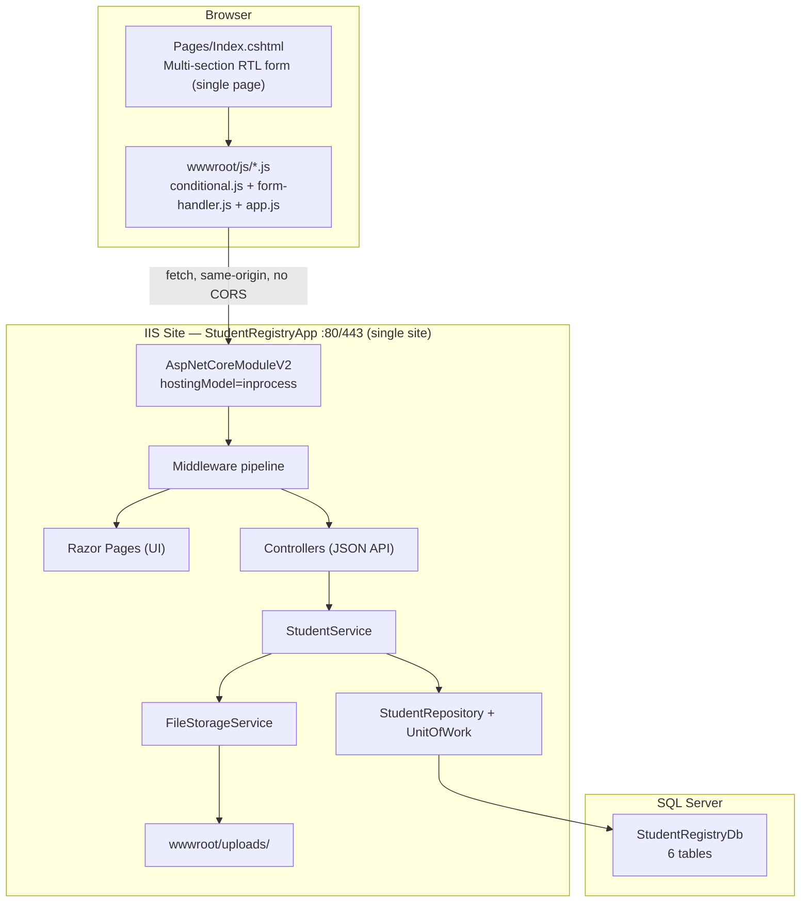

# Student Equivalent Certificate / Registration System — Architecture Reference

This document describes the current codebase architecture. It is intended as a safe foundation for adding features without breaking existing behavior.

**As of 2026-07-23** this is a **single ASP.NET Core 8 project** (`backend/StudentRegistry.API`) that serves both the registration form (Razor Pages, server-rendered HTML + vanilla JS) and the JSON API from the same process. There is no separate Angular frontend and no PHP anywhere in this repo — both were removed and their functionality (including several personal/guardian/address fields the old PHP/HTML form had that the Angular version was missing) was folded into this one app.

---

## 1. System Architecture & End-to-End Data Flow

### High-level topology



### Deployment layout (production)

| Component | Location | Port / binding |
|-----------|----------|----------------|
| Whole app (UI + API) | `C:\publish\api` (from `dotnet publish StudentRegistry.API -c Release`) | Single IIS site, 80/443 |
| Student photos | `C:\publish\api\wwwroot\uploads\` | Served via ASP.NET Core static files |
| Database | `StudentRegistryDb` on SQL Server | TCP (default 1433) |

There is exactly one publish output and one IIS site — no separate frontend deployment, no CORS configuration needed (same-origin).

---

### Complete registration flow (student form → persistence)

#### Phase A — Page load

1. Browser requests `/` → `Pages/Index.cshtml` (Razor Page) renders server-side into plain HTML (`lang="ar" dir="rtl"`), wrapped by `Pages/Shared/_Layout.cshtml`.
2. `wwwroot/js/conditional.js`'s `initConditionals()` runs on load and calls `loadSubjectsConfig()`:
   - **GET** `/api/config/subjects` → certifications, tracks, standard year subjects.
   - **GET** `/api/config/subjects-saudi` → Saudi subject blocks with coefficients.
   - These are the **only** source of this data — there is no duplicate JSON file and no inline JS fallback object anymore. If either call fails, an alert is shown and the form cannot proceed (previously there were four places holding a copy of this data; now there is one).

#### Phase B — Single-page form (client-side only)

All sections render on one page simultaneously; only real conditional behavior is: track `<select>` disabled until a certification is chosen, year section hidden for IG, and the grades sub-container swapping between three UIs. A cosmetic step-progress bar (`wwwroot/js/app.js`) reflects field-completion state but does not gate visibility.

| Section | Content | Cert-specific behavior |
|------|---------|------------------------|
| A | Photo upload (base64, 2:3 aspect ratio check) | All certs |
| B | Name (AR+EN), National ID, phone, email, guardian info, full address | All certs |
| C | Certification + Track (track locks after selection) | 5 cert keys: `ig`, `saudi`, `qatari`, `bahraini`, `kuwaiti` |
| D | Year of study | Hidden for IG; shown for others |
| E | Grades entry | Three distinct UIs and calculation paths |

**Live GPA calculations (frontend only, for display — server recalculates authoritatively at persist time):**

| Cert | Method | Formula |
|------|--------|---------|
| Saudi | `recalculateSaudi()` in `form-handler.js` | `(totalWeighted / (100 × totalCoefficients)) × 100` |
| IG | `calculateIGScore()` | Points-based %, optional factor, sports bonus 0–30%, government score = `(scorePercentage / 100) × 410` |
| Standard (Qatari/Bahraini/Kuwaiti) | `recalculateStandard()` (inline per row) | `achieved = (grade × weight) / 100`; no aggregate GPA computed |

#### Phase C — Submission

1. User clicks submit → `setupSubmissionHandler()` runs `validateForm()`, then `compilePayload()` builds an internal rich payload, then `sendData()` maps it to the API DTO shape.
2. Certification string mapping (must stay in sync with `StudentService`/`StudentCreateDtoValidator`):
   - `saudi` → `"Saudi Certificate"`
   - `ig` → `"IG"`
   - others → cert key/display text as-is (`qatari`, etc.)
3. **POST** `/api/students/register` (same-origin, relative URL) with JSON body including base64 photo and all personal/guardian/address fields.
4. On network failure only, the payload is saved to `localStorage` (`student_submissions` key) and the success screen still shows, badged as "saved locally" — this is a client-side safety net, not a real submission path.

#### Phase D — API request pipeline

Middleware order in `Program.cs`:

```
HSTS (prod) → HTTPS redirect → SecurityHeadersMiddleware → CookiePolicy
→ ExceptionMiddleware → StaticFiles → Routing → Authorization → Controllers → RazorPages
```

There is no CORS middleware — the UI and API are same-origin.

#### Phase E — Controller layer

`StudentsController.RegisterStudent`:

1. FluentValidation via `StudentCreateDtoValidator` (cert-conditional rules, plus required-field + format rules for the personal/guardian/address block).
2. On validation failure → **400** `{ status: "error", message: "<first Arabic error>" }`.
3. Calls `StudentService.RegisterStudentAsync()`.
4. On success → **200** `{ status: "success", message, file_path, data }`.

#### Phase F — Application / business layer

`StudentService.RegisterStudentAsync`:

1. **Uniqueness check** — reject duplicate `NationalId`.
2. **Photo save** — `FileStorageService.SaveBase64ImageAsync()`:
   - Validates MIME header, magic bytes, max 5 MB.
   - Writes to `wwwroot/uploads/{nationalId}_{guid}.{ext}`.
   - Returns relative path `uploads/...` for DB.
3. **Map base student** via AutoMapper (`StudentCreateDto → Student`, including the personal/guardian/address fields — these map by convention since property names match exactly).
4. **Branch by certification** (string matching):

```csharp
string cert = createDto.Certification;
if (cert.Contains("سعودية") || cert.Equals("Saudi Certificate", StringComparison.OrdinalIgnoreCase))
{
    ProcessSaudiCertificate(createDto, student);
}
else if (cert.Contains("IG") || cert.Equals("ig", StringComparison.OrdinalIgnoreCase))
{
    ProcessIgCertificate(createDto, student);
}
else
{
    ProcessStandardCertificate(createDto, student);
}
```

5. **Persist** via `UnitOfWork.Students.AddAsync()` + `CompleteAsync()` (EF `SaveChangesAsync`).
6. **Return** mapped `StudentResponseDto`.

#### Phase G — Database persistence

Single transaction inserts into:

```
Students (root — now includes StudentNameEn, Phone, Email, GuardianName,
          GuardianPhone, GuardianRelation, AddressGov, AddressCenter,
          AddressVillage, AddressStreet, AddressBuilding, AddressFloor)
├── SaudiStudentTotals + SaudiStudentGrades     (Saudi cert)
├── IGStudentGrades + IGStudentGradeCounts      (IG cert)
└── StandardStudentGrades                       (Qatari/Bahraini/Kuwaiti)
```

All child tables use **ON DELETE CASCADE** from `Students.Id`.

Unique constraint: `Students.NationalId` — duplicate submissions fail at DB level if app check is bypassed.

#### Phase H — Response & receipt

The client shows a success screen in-page; the user can download a JSON or CSV receipt built from the client-side payload (`downloadReceiptFile()`). The photo is accessible at `/{photoPath}` (e.g. `/uploads/xxx.png`) via static file serving.

---

### Database schema (6 tables)

| Table | Relationship | Purpose |
|-------|-------------|---------|
| `Students` | Root | Identity, contact/guardian/address info, cert type, track, photo path, timestamp |
| `SaudiStudentTotals` | 1:1 | Aggregated Saudi GPA |
| `SaudiStudentGrades` | 1:N | Per-subject Saudi grades by year block |
| `IGStudentGrades` | 1:1 | IG program, factor, bonus, computed scores |
| `IGStudentGradeCounts` | 1:N | Grade distribution (type/grade/count) |
| `StandardStudentGrades` | 1:N | Per-subject grades for non-Saudi/non-IG certs |

**Source of truth: EF Core Migrations** (`StudentRegistry.Data/Migrations/`, first bootstrapped 2026-07-23 as `InitialCreate`). `database/schema.sql` is kept as a human-readable reference copy of the same schema but migrations are what actually gets applied — always generate a new migration for schema changes rather than hand-editing `schema.sql` alone.

---

## 2. Backend Layer Responsibilities & Where New Code Goes

### Dependency flow (strict one-way)

```
API → Application → Domain ← Data ← Repository
API → Infrastructure (implements Application interfaces)
```

| Layer | Project | Responsibility | Add new code here when… |
|-------|---------|----------------|-------------------------|
| **Domain** | `StudentRegistry.Domain` | Entities, repository interfaces (`IStudentRepository`, `IUnitOfWork`) | Adding a new entity/table, or a new repository contract |
| **Application** | `StudentRegistry.Application` | DTOs, services, FluentValidation, AutoMapper profiles, service interfaces | Business rules, validation, grade calculations, orchestration |
| **Data** | `StudentRegistry.Data` | `StudentRegistryDbContext`, EF fluent configurations, Migrations | Mapping entities to tables, indexes, FKs, schema changes |
| **Repository** | `StudentRegistry.Repository` | `StudentRepository`, `UnitOfWork` — EF queries | New read/write query patterns |
| **Infrastructure** | `StudentRegistry.Infrastructure` | `FileStorageService` (external I/O) | File storage, email, external APIs |
| **API** | `StudentRegistry.API` | Controllers, **Pages/ (Razor Pages UI)**, **wwwroot/ (CSS/JS static assets)**, middleware, `Program.cs`, IIS config | HTTP endpoints, UI markup/client JS, pipeline, DI registration |

### Concrete placement guide

| What you're adding | Where it goes | What you register/update |
|--------------------|---------------|--------------------------|
| New validation rule | `Application/Validators/StudentValidator.cs` (`StudentCreateDtoValidator`) | Auto-discovered via `AddValidatorsFromAssembly` |
| New business calculation | `Application/Services/StudentService.cs` (extend or new `IXxxService`) | Register in `Program.cs` DI |
| New HTTP endpoint | `API/Controllers/` (new controller or action) | Thin controller — delegate to service |
| UI change (markup, layout) | `API/Pages/Index.cshtml` + `Pages/Shared/_Layout.cshtml` | No code-behind logic needed — `IndexModel.OnGet()` is empty by design |
| Client-side behavior change | `API/wwwroot/js/{conditional,form-handler,app}.js` | Vanilla JS, no build step — edits take effect on page refresh |
| New DB table/column | `Domain/Entities/` + `Data/Configurations/` + **new EF migration** | Update `DbContext` DbSets |
| New query (reports) | `Repository/Implementations/` + optional new interface in Domain | Register in DI |
| New DTO field | `Application/DTOs/StudentDto.cs` + verify `MappingProfile.cs` still auto-maps by name | Update validator if required |
| File storage change | `Infrastructure/Storage/FileStorageService.cs` | Do not put I/O in Application services directly |

### Rules to preserve layering

- **Controllers** must not access `DbContext` directly.
- **Repositories** must not contain business logic (only data access).
- **Domain** must not reference Application, Data, or API.
- **Grade calculations** for Saudi/IG belong in `StudentService` (server is authoritative at persist time).
- **Config metadata** (subjects, tracks, coefficients) is hardcoded in `ConfigController` — not in the DB. This is now the **only** copy (see section 4.C).

---

## 3. Sensitive Points — Do Not Touch Carelessly

| Area | Location | Risk if changed | Safe approach |
|------|----------|-----------------|----------------|
| **IIS hosting model** | `backend/StudentRegistry.API/web.config` → `hostingModel="inprocess"` | Performance regression, 502.5 errors | Keep in-process unless you have a tested reason to switch |
| **Request size limit** | `web.config` → `maxAllowedContentLength` | Photo uploads fail silently | Must stay ≥ 6 MB (photos max 5 MB in code) |
| **ExceptionMiddleware** | `API/Middleware/ExceptionMiddleware.cs` | Stack traces leak in prod; inconsistent error shape | Never remove; extend exception mapping if needed |
| **SecurityHeadersMiddleware** | `API/Middleware/SecurityHeadersMiddleware.cs` | CSP breaks the page/JS/fonts | Update CSP directives if adding new external resources (fonts, scripts) |
| **Connection string** | `appsettings*.json` → `DefaultConnection` | Total outage | Change only via deployment config; test restore after |
| **Health check endpoint** | `Program.cs` → `/health` | Load balancer marks node unhealthy | Keep path stable; extend checks additively |
| **Middleware pipeline order** | `Program.cs` | Security/exception handling breaks, Razor Pages/Controllers stop routing | Insert new middleware adjacent to similar concerns; keep `MapControllers()`/`MapRazorPages()` both present |
| **EF schema / migrations** | `StudentRegistry.Data/Migrations/`, `database/schema.sql` | Data loss, FK violations | Always additive migrations; never edit an already-applied migration file |
| **Cascade delete on FKs** | All child tables → `Students` | Accidental mass delete | Understand before adding new FKs |
| **NationalId unique constraint** | `Students.UQ_Students_NationalId` (index) | Duplicate registrations or broken lookups | Do not remove without business approval |
| **Certification string matching** | `StudentService` + `StudentCreateDtoValidator` + `wwwroot/js/form-handler.js`'s `sendData()` mapping | Wrong processing branch (Saudi logic on IG data) | Keep matching logic in sync in all three places |
| **IG point tables** | `StudentService.GetIgPoints()` + `wwwroot/js/form-handler.js`'s `igPointsMapping` | Wrong government scores | Change both + manually re-verify (see "Known Housekeeping Gaps") |
| **Saudi GPA formula** | `StudentService.ProcessSaudiCertificate` + `wwwroot/js/form-handler.js`'s `recalculateSaudi()` | Incorrect final percentages | Change both + test |
| **AutoMapper grade formulas** | `MappingProfile.cs` | Wrong `Weighted`/`Achieved` stored | Test with sample payloads |
| **FileStorageService validation** | Magic bytes, 5 MB limit, filename sanitization | Malicious uploads | Extend carefully; don't bypass checks |
| **Swagger exposure** | `Program.cs` — only in Development | API schema public in prod | Keep `IsDevelopment()` guard |
| **Upload folder permissions** | `wwwroot/uploads` on IIS | 500 on registration | Grant `IIS_IUSRS` + app pool identity Write |
| **SQL backup schedule** | SQL Server Agent jobs | Unrecoverable data loss | Coordinate schema changes with backup/restore tests |

---

## 4. How to Add New Features With Minimal Impact

### A. New certification type (e.g., "Omani Certificate")

This is the highest-impact change — touches all tiers.

| Step | Action |
|------|--------|
| 1 | Add cert entry in `ConfigController.GetSubjectsConfig()` (tracks + subject years if standard-like) |
| 2 | Decide processing model: **Saudi-like**, **IG-like**, or **Standard-like** |
| 3 | If new storage shape needed → new Domain entity + `Data/Configurations/` + **EF migration** |
| 4 | Extend `StudentCreateDto` + `StudentResponseDto` |
| 5 | Add `When()` branch in `StudentCreateDtoValidator` |
| 6 | Add `ProcessXxxCertificate()` in `StudentService` (or reuse `ProcessStandardCertificate`) |
| 7 | Update `StudentRepository` includes if new navigation property |
| 8 | Update `MappingProfile` if any calculated fields are needed |
| 9 | Update `wwwroot/js/form-handler.js`'s `sendData()` certification-string mapping if the new cert needs special-casing |

**Migration required?** Yes, if new tables/columns. No, if reusing `StandardStudentGrades` with a new cert string.

**New controller?** No — extend existing `StudentsController` + `ConfigController`. **No Angular/frontend project to touch anymore.**

---

### B. New academic track (same certification type)

| Step | Action |
|------|--------|
| 1 | Add track string to `ConfigController`'s cert `tracks` array |

That's it — the UI fetches this live from `/api/config/subjects`, there is no second copy to update anymore.

**Migration required?** No — `Track` is a free-text column on `Students`.

---

### C. New subject in an existing year/block, or a new track on an existing certification

**There is now exactly one sync point** (this used to be four separate JSON/JS/API copies before the Angular/PHP removal):

| # | File | What to change |
|---|------|-----------------|
| 1 | `backend/StudentRegistry.API/Controllers/ConfigController.cs` — `GetSubjectsConfig()` (`certifications`/`subjects`) or `GetSaudiSubjectsConfig()` (`block_1`/`block_2`/`block_3`) | Authoritative data the page fetches at runtime via `GET /api/config/subjects` and `GET /api/config/subjects-saudi` — nothing else needs updating. |

**Saudi year-block display labels** (e.g. "الصف الثالث الثانوي") are a **separate concern** from the subject/coefficient data above — they're computed client-side from the selected `year-select` value ("One Year" / "Two Years" / "Three Years") inside `getSaudiBlocks()` in `wwwroot/js/conditional.js`. There is only one copy of this logic now (previously duplicated between the Angular app and the legacy PHP form's JS).

**Migration required?** No — subject names, track names, and block labels are all strings.

---

### D. Statistical report (e.g., "registrations by cert type this month")

| Step | Action |
|------|--------|
| 1 | Create `ReportsController` (read-only) in API |
| 2 | Create `IReportService` + `ReportService` in Application |
| 3 | Add query methods in Repository (`.AsNoTracking()` for read-only) |
| 4 | **Do not** modify registration flow |

**Migration required?** Only if you need new indexes for performance (optional, additive).

**New controller?** Yes — keeps `StudentsController` focused on CRUD/register.

---

### E. Admin export / bulk read

Reuse `GET api/Students` or add filtered endpoint with query params. Add repository method with `.AsNoTracking()`. No schema change unless you need audit columns.

---

### When is an EF Core migration required?

| Change | Migration? |
|--------|------------|
| New table | Yes |
| New column on existing table | Yes |
| New index | Yes (recommended) |
| Changed column type/nullability | Yes (careful — data migration) |
| New cert using existing grade tables | No |
| Config-only (subjects/tracks/coefficients in `ConfigController`) | No |
| New read-only report query | No |
| Renaming/removing column | Yes + data migration plan + backup |

```powershell
dotnet ef migrations add <Name> --project StudentRegistry.Data --startup-project StudentRegistry.API
dotnet ef database update --project StudentRegistry.Data --startup-project StudentRegistry.API
```

Migrations **are** committed to source control (unlike before 2026-07-23) — always commit the generated migration files alongside the entity/config change that produced them.

---

## 5. Pre-Feature Checklist

Before merging or deploying any new feature:

### Architecture & code

- [ ] New code is in the correct layer (no `DbContext` in controllers, no business logic in repositories)
- [ ] DTOs updated; `MappingProfile` verified (convention-based mapping works if names match exactly, otherwise add explicit `ForMember`)
- [ ] FluentValidation rules added/extended for new required fields
- [ ] Certification branching consistent in **validator**, **service**, and **`form-handler.js`'s `sendData()`**
- [ ] If grade math changed: backend (`StudentService`) + frontend (`form-handler.js`) both updated and manually re-verified (see gap below — automated regression tests are not currently runnable)
- [ ] New DI registrations added in `Program.cs` if new services/repos

### Database & backup

- [ ] Schema change has an additive EF migration, committed to source control
- [ ] Migration tested on a copy of `StudentRegistryDb`
- [ ] Backup/restore verified after migration (Full + log chain intact)
- [ ] Cascade delete behavior understood for new FKs

### Security & error handling

- [ ] No stack traces exposed in Production (`ExceptionMiddleware` unchanged behavior)
- [ ] New endpoints return `{ status, message }` shape consistently
- [ ] Input sanitized (HTML blocked where applicable; file uploads validated)
- [ ] CSP updated in `SecurityHeadersMiddleware` if adding new external script/style/font sources

### IIS & deployment

- [ ] `web.config` hostingModel remains `inprocess` unless intentionally changed
- [ ] `maxAllowedContentLength` still accommodates photo uploads
- [ ] `wwwroot/uploads` exists with correct IIS write permissions
- [ ] `/health` returns 200 after deploy

### Operations

- [ ] Swagger still disabled in Production
- [ ] Logging level appropriate (`Warning`/`Error` in prod)
- [ ] SQL Server Agent backup jobs unaffected by schema change
- [ ] If horizontal scaling: shared UNC path planned for uploads (not yet implemented in code)

---

## Known Housekeeping Gaps (verified 2026-07-23)

- **No automated test runner is wired up for the ported client-side calculation logic.** The regression tests that used to exist in the Angular project (`app.component.spec.ts`, comparing Angular vs. legacy JS calculators) no longer exist — there was no equivalent Angular app to test after the rebuild. If you change `recalculateSaudi()`, `calculateIGScore()`, or `recalculateStandard()` in `wwwroot/js/form-handler.js`, verify manually against `StudentService`'s formulas (documented above) — there is no automated safety net for this today.
- **`AutoMapper` 13.0.1 has a known high-severity NuGet advisory** (`GHSA-rvv3-g6hj-g44x`), surfaced as a `dotnet build` warning (NU1903). Not yet remediated; worth a version bump when convenient.
- **`appsettings.Production.json` contains a placeholder plaintext SQL password.** Replace with a real secret-management approach (Windows Integrated Security, Azure Key Vault, environment variable substitution, etc.) before any real production deployment — do not deploy the placeholder value as-is.

---

## Current Live Configuration Data (snapshot, verify against `ConfigController.cs` before relying on exact values)

**Certifications & tracks** (`GET /api/config/subjects` → `certifications`):

| Cert key | Display name | Tracks |
|---|---|---|
| `ig` | شهادات الـ IG (IGCSE/O-Level/A-Level) | IGCSE (Early Years) - مواد عامة / A-Levels (Advanced Years) - تخصص علمي أو أدبي / AS-Levels (Intermediate Year) - انتقالى |
| `saudi` | شهادة سعودية | المسار العام / مسار العلوم / مسار الإدارة والأعمال / مسار الهندسة والتكنولوجيا / مسار العلوم الإنسانية |
| `qatari` | شهادة قطرية | المسار العلمي / المسار الأدبي والإنسانيات / مسار التكنولوجيا |
| `bahraini` | شهادة بحرينية | مسار العلوم والرياضيات / مسار اللغات والعلوم الإنسانية / مسار العلوم التجارية |
| `kuwaiti` | شهادة كويتية | القسم العلمي / القسم الأدبي |
| `omani` | شهادة عمانية | الشهادة الثانوية العمانية (single fixed track) |
| `yemeni` | شهادة يمنية | الشهادة الثانوية اليمنية (single fixed track) |

**Standard subjects** (`GET /api/config/subjects` → `subjects`, used by Qatari/Bahraini/Kuwaiti certs): `year_1`, `year_2`, `year_3` — each an array of ~8 Arabic subject names.

**Saudi blocks** (`GET /api/config/subjects-saudi`): `block_1` (24 subjects), `block_2` (20 subjects), `block_3` (23 subjects), each subject an object `{ name, coefficient }`. Block-to-displayed-year mapping depends on the selected `year-select` value:
- "One Year" → shows `block_1` only, labeled "الصف الثالث الثانوي"
- "Two Years" → shows `block_1` then `block_2`, labeled "الصف الثاني الثانوي" then "الصف الثالث الثانوي"
- "Three Years" → shows `block_1`, `block_2`, `block_3`, labeled "الصف الأول/الثاني/الثالث الثانوي"

For exact subject lists and coefficients, read `ConfigController.cs` directly.

**`Student` entity fields (as of the 2026-07-23 rebuild):** `StudentName`, `StudentNameEn`, `NationalId`, `Phone`, `Email`, `GuardianName`, `GuardianPhone`, `GuardianRelation`, `AddressGov`, `AddressCenter`, `AddressVillage` (nullable), `AddressStreet`, `AddressBuilding`, `AddressFloor` (nullable), `Certification`, `Track`, `PhotoPath`, `SubmittedAt`.

---

## Prompt Template — For an AI Assistant Turning a Feature Request Into a Claude Code Task

If you (an AI assistant with no repo access) are reading this document because the user pasted it and described a change they want, use this template to produce a precise instruction they can hand to Claude Code (or any coding agent with repo access). Fill in the bracketed parts from what the user told you; do not invent subject names, coefficients, or tracks not stated by the user or shown in the snapshot above.

**Case 1 — Add a new subject to an existing certification/block:**
```
Add the subject "[SUBJECT NAME IN ARABIC]" [with coefficient N, if Saudi] to
[certification key: ig|saudi|qatari|bahraini|kuwaiti] [block_1/block_2/block_3 if Saudi,
or year_1/year_2/year_3 if standard]. This is config-only — update
backend/StudentRegistry.API/Controllers/ConfigController.cs only (per
ARCHITECTURE.md section 4.C, this is the single source of truth; nothing else
needs updating since the UI fetches this live). Do not touch grade-calculation
logic, DB schema, or migrations.
```

**Case 2 — Add a new track to an existing certification:**
```
Add the track "[TRACK NAME IN ARABIC]" to the "[cert key]" certification.
Update only ConfigController.cs (GetSubjectsConfig -> certifications[key].tracks).
No migration needed — Track is a free-text column.
```

**Case 3 — Add a brand-new certification type (e.g. "Omani Certificate"):**
```
Add a new certification "[NAME]" with cert key "[key]" and tracks [list].
Processing model: [choose one — Saudi-like (cumulative weighted % with coefficients) /
IG-like (points + factor + sports bonus) / Standard-like (per-subject grade × weight)].
Follow ARCHITECTURE.md section "4.A New certification type" step by step:
ConfigController -> StudentCreateDto/StudentResponseDto ->
StudentCreateDtoValidator (When() branch) -> StudentService (Process[X]Certificate method) ->
MappingProfile -> new Domain entity + EF migration only if a new grade shape is needed ->
wwwroot/js/form-handler.js's sendData() certification mapping if special-casing is needed.
Keep certification string-matching logic identical between StudentService,
StudentCreateDtoValidator, and form-handler.js's sendData().
```

**Case 4 — Anything touching grade math (GPA formulas, IG points, coefficients):**
```
[Describe the calculation change.]
This must be changed in BOTH the backend (StudentService.cs — the relevant
Process[X]Certificate method or GetIgPoints()) AND the frontend
(wwwroot/js/form-handler.js — the matching calculation function), or the number
the student sees during entry will not match what gets persisted.
Note: there is currently no automated test coverage for this logic (see
"Known Housekeeping Gaps") — verify the calculation manually by submitting a
test registration and comparing the displayed value to the persisted DB row.
```

Always end the generated prompt with: *"Read ARCHITECTURE.md sections 2 and 3 before starting — some areas (connection strings, cascade deletes, certification string matching, migrations) are marked 'do not touch carelessly'."*

---

## Related documentation

- `MIGRATION_DEPLOYMENT_GUIDE.md` — Local setup and IIS deployment steps
- `PRODUCTION_OPERATIONS_AND_NFR_GUIDE.md` — Monitoring, logging, backups, scalability
- `database/schema.sql` — Human-readable reference copy of the schema (EF Migrations are the real source of truth)
