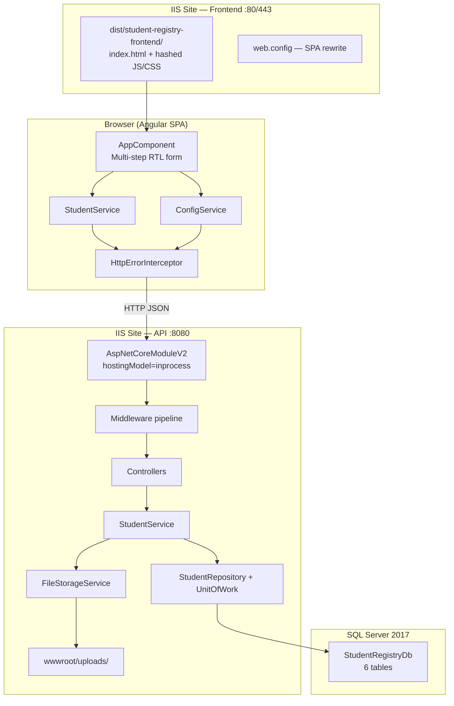

# Student Equivalent Certificate / Registration System — Architecture Reference

This document describes the current codebase architecture. It is intended as a safe foundation for adding features without breaking existing behavior.

---

## 1. System Architecture & End-to-End Data Flow

### High-level topology



### Deployment layout (production)

| Component | Location | Port / binding |
|-----------|----------|----------------|
| Angular SPA | `C:\publish\frontend` (from `ng build --configuration production`) | IIS site 80/443 |
| ASP.NET Core API | `C:\publish\api` (from `dotnet publish -c Release`) | IIS site 8080 (or host header) |
| Student photos | `C:\publish\api\wwwroot\uploads\` | Served via API static files |
| Database | `StudentRegistryDb` on SQL Server 2017 | TCP (default 1433) |

**Important build-path note:** `angular.json` uses the classic `browser` builder with `outputPath: "dist/student-registry-frontend"`. The deployment guide mentions a `browser/` subfolder, but that applies to Angular's newer `application` builder — the actual output is:

```
frontend/dist/student-registry-frontend/
```

---

### Complete registration flow (student form → persistence)

#### Phase A — Application bootstrap

1. Browser loads `index.html` (`lang="ar" dir="rtl"`).
2. `AppComponent.ngOnInit()` calls `loadConfiguration()`.
3. **GET** `{apiUrl}/api/config/subjects` → certifications, tracks, standard year subjects.
4. **GET** `{apiUrl}/api/config/subjects-saudi` → Saudi year blocks with coefficients.
5. On API failure, hardcoded Arabic fallbacks in `app.component.ts` are used (offline resilience).

#### Phase B — Multi-step form (client-side only)

| Step | Content | Cert-specific behavior |
|------|---------|------------------------|
| 1 | Photo upload (base64, 2:3 aspect ratio) | All certs |
| 2 | Name + National ID | All certs |
| 3 | Certification + Track (track locks after selection) | 5 cert keys: `ig`, `saudi`, `qatari`, `bahraini`, `kuwaiti` |
| 4 | Year of study | Skipped for IG (4 steps total); 5 steps for others |
| 4/5 | Grades entry | Three distinct UIs and calculation paths |

**Live GPA calculations (frontend only, for display):**

| Cert | Method | Formula |
|------|--------|---------|
| Saudi | `calculateSaudiGPA()` | `(totalWeighted / (100 × totalCoefficients)) × 100` |
| IG | `calculateIGGPA()` | Points-based %, optional factor, sports bonus 0–30%, government score = `(scorePercentage / 100) × 410` |
| Standard (Qatari/Bahraini/Kuwaiti) | Inline per row | `achieved = (grade × weight) / 100`; aggregate GPA computed client-side only |

#### Phase C — Submission

1. User clicks submit → `onSubmit()` builds `StudentCreateDto`.
2. Certification string mapping:
   - `saudi` → `"Saudi Certificate"`
   - `ig` → `"IG"`
   - others → cert key as-is (`qatari`, etc.)
3. **POST** `{apiUrl}/api/students/register` with JSON body including base64 photo.

#### Phase D — API request pipeline

Middleware order in `Program.cs`:

```
HSTS (prod) → HTTPS redirect → SecurityHeadersMiddleware → CookiePolicy
→ ExceptionMiddleware → StaticFiles → Routing → CORS → Authorization → Controllers
```

#### Phase E — Controller layer

`StudentsController.RegisterStudent`:

1. FluentValidation via `StudentCreateDtoValidator` (cert-conditional rules).
2. On validation failure → **400** `{ status: "error", message: "<first Arabic error>" }`.
3. Calls `StudentService.RegisterStudentAsync()`.
4. On success → **200** `{ status: "success", message, file_path, data }`.

#### Phase F — Application / business layer

`StudentService.RegisterStudentAsync`:

1. **Uniqueness check** — reject duplicate `NationalId`.
2. **Photo save** — `FileStorageService.SaveBase64ImageAsync()`:
   - Validates MIME header, magic bytes, max 5 MB
   - Writes to `wwwroot/uploads/{nationalId}_{guid}.{ext}`
   - Returns relative path `uploads/...` for DB
3. **Map base student** via AutoMapper (`StudentCreateDto → Student`).
4. **Branch by certification** (string matching):

```csharp
string cert = createDto.Certification;
if (cert.Contains("سعودية") || cert.Equals("Saudi Certificate", StringComparison.OrdinalIgnoreCase))
{
    ProcessSaudiCertificate(createDto, student);
}
else if (cert.Contains("IG") || cert.Equals("ig", StringComparison.OrdinalIgnoreCase))
{
    ProcessIgCertificate(createDto, student);
}
else
{
    ProcessStandardCertificate(createDto, student);
}
```

5. **Persist** via `UnitOfWork.Students.AddAsync()` + `CompleteAsync()` (EF `SaveChangesAsync`).
6. **Return** mapped `StudentResponseDto`.

#### Phase G — Database persistence

Single transaction inserts into:

```
Students (root)
├── SaudiStudentTotals + SaudiStudentGrades     (Saudi cert)
├── IGStudentGrades + IGStudentGradeCounts      (IG cert)
└── StandardStudentGrades                       (Qatari/Bahraini/Kuwaiti)
```

All child tables use **ON DELETE CASCADE** from `Students.Id`.

Unique constraint: `Students.NationalId` — duplicate submissions fail at DB level if app check is bypassed.

#### Phase H — Response & receipt

Frontend shows success screen; user can download JSON/CSV receipt from `submittedStudent` response data. Photo is accessible at `{apiUrl}/{photoPath}` via API static file serving.

---

### Database schema (6 tables)

| Table | Relationship | Purpose |
|-------|-------------|---------|
| `Students` | Root | Identity, cert type, track, photo path, timestamp |
| `SaudiStudentTotals` | 1:1 | Aggregated Saudi GPA |
| `SaudiStudentGrades` | 1:N | Per-subject Saudi grades by year block |
| `IGStudentGrades` | 1:1 | IG program, factor, bonus, computed scores |
| `IGStudentGradeCounts` | 1:N | Grade distribution (type/grade/count) |
| `StandardStudentGrades` | 1:N | Per-subject grades for non-Saudi/non-IG certs |

Source of truth: `database/schema.sql`. **No EF Core migration files are committed** — migrations are generated locally per `MIGRATION_DEPLOYMENT_GUIDE.md`.

---

## 2. Backend Layer Responsibilities & Where New Code Goes

### Dependency flow (strict one-way)

```
API → Application → Domain ← Data ← Repository
API → Infrastructure (implements Application interfaces)
```

| Layer | Project | Responsibility | Add new code here when… |
|-------|---------|----------------|-------------------------|
| **Domain** | `StudentRegistry.Domain` | Entities, repository interfaces (`IStudentRepository`, `IUnitOfWork`) | Adding a new entity/table, or a new repository contract |
| **Application** | `StudentRegistry.Application` | DTOs, services, FluentValidation, AutoMapper profiles, service interfaces | Business rules, validation, grade calculations, orchestration |
| **Data** | `StudentRegistry.Data` | `StudentRegistryDbContext`, EF fluent configurations | Mapping entities to tables, indexes, FKs |
| **Repository** | `StudentRegistry.Repository` | `StudentRepository`, `UnitOfWork` — EF queries | New read/write query patterns |
| **Infrastructure** | `StudentRegistry.Infrastructure` | `FileStorageService` (external I/O) | File storage, email, external APIs |
| **API** | `StudentRegistry.API` | Controllers, middleware, `Program.cs`, IIS config | HTTP endpoints, pipeline, DI registration |

### Concrete placement guide

| What you're adding | Where it goes | What you register/update |
|--------------------|---------------|--------------------------|
| New validation rule | `Application/Validators/` (extend `StudentCreateDtoValidator` or new validator class) | Auto-discovered via `AddValidatorsFromAssembly` |
| New business calculation | `Application/Services/` (extend `StudentService` or new `IXxxService`) | Register in `Program.cs` DI |
| New HTTP endpoint | `API/Controllers/` (new controller or action) | Thin controller — delegate to service |
| New DB table/column | `Domain/Entities/` + `Data/Configurations/` + migration | Update `DbContext` DbSets |
| New query (reports) | `Repository/Implementations/` + optional new interface in Domain | Register in DI |
| New DTO field | `Application/DTOs/StudentDto.cs` + `MappingProfile.cs` | Update validator if required |
| File/UNC storage change | `Infrastructure/Storage/FileStorageService.cs` | Do not put I/O in Application services directly |

### Rules to preserve layering

- **Controllers** must not access `DbContext` directly.
- **Repositories** must not contain business logic (only data access).
- **Domain** must not reference Application, Data, or API.
- **Grade calculations** for Saudi/IG belong in `StudentService` (server is authoritative at persist time).
- **Config metadata** (subjects, tracks) is currently hardcoded in `ConfigController` — not in DB.

---

## 3. Sensitive Points — Do Not Touch Carelessly

| Area | Location | Risk if changed | Safe approach |
|------|----------|-----------------|---------------|
| **IIS hosting model** | `backend/StudentRegistry.API/web.config` → `hostingModel="inprocess"` | Performance regression, 502.5 errors | Keep in-process unless you have a tested reason to switch |
| **Request size limit** | `web.config` → `maxAllowedContentLength="10485760"` (10 MB) | Photo uploads fail silently | Must stay ≥ 6 MB (photos max 5 MB in code) |
| **ExceptionMiddleware** | `API/Middleware/ExceptionMiddleware.cs` | Stack traces leak in prod; inconsistent error shape | Never remove; extend exception mapping if needed |
| **SecurityHeadersMiddleware** | `API/Middleware/SecurityHeadersMiddleware.cs` | CSP breaks frontend/API calls; XSS exposure | Update `connect-src` when adding new API domains |
| **CORS AllowedOrigins** | `appsettings.json` / `appsettings.Production.json` | Frontend blocked entirely | Add new frontend URLs here; restart IIS |
| **Connection string** | `appsettings*.json` → `DefaultConnection` | Total outage | Change only via deployment config; test restore after |
| **Health check endpoint** | `Program.cs` → `/health` | Load balancer marks node unhealthy | Keep path stable; extend checks additively |
| **Middleware pipeline order** | `Program.cs` | CORS/security/exception handling breaks | Insert new middleware adjacent to similar concerns |
| **EF schema / migrations** | `database/schema.sql`, future `Data/Migrations/` | Data loss, FK violations | Always additive migrations; never edit applied migrations |
| **Cascade delete on FKs** | All child tables → `Students` | Accidental mass delete | Understand before adding new FKs |
| **NationalId unique constraint** | `Students.UQ_Students_NationalId` | Duplicate registrations or broken lookups | Do not remove without business approval |
| **Certification string matching** | `StudentService` + `StudentValidator` | Wrong processing branch (Saudi logic on IG data) | Keep matching logic in sync in both places |
| **IG point tables** | `StudentService.GetIgPoints()` + frontend `igPointsMapping` | Wrong government scores | Change both + run `app.component.spec.ts` regression tests |
| **Saudi GPA formula** | `StudentService.ProcessSaudiCertificate` + frontend `calculateSaudiGPA` | Incorrect final percentages | Change both + test |
| **AutoMapper grade formulas** | `MappingProfile.cs` | Wrong `Weighted`/`Achieved` stored | Test with sample payloads |
| **FileStorageService validation** | Magic bytes, 5 MB limit, filename sanitization | Malicious uploads | Extend carefully; don't bypass checks |
| **Swagger exposure** | `Program.cs` — only in Development | API schema public in prod | Keep `IsDevelopment()` guard |
| **Frontend SPA rewrite** | `frontend/src/web.config` | 404 on refresh | Deploy with built assets |
| **Angular environment wiring** | `environment.ts` used always (no `fileReplacements`) | Prod builds hit wrong API URL | Add `fileReplacements` before prod deploy |
| **Upload folder permissions** | `wwwroot/uploads` on IIS | 500 on registration | Grant `IIS_IUSRS` + app pool identity Write |
| **SQL backup schedule** | SQL Server Agent jobs | Unrecoverable data loss | Coordinate schema changes with backup/restore tests |

---

## 4. How to Add New Features With Minimal Impact

### A. New certification type (e.g., "Omani Certificate")

This is the highest-impact change — touches all tiers.

| Step | Action |
|------|--------|
| 1 | Add cert entry in `ConfigController.GetSubjectsConfig()` (tracks + subject years if standard-like) |
| 2 | Add frontend fallback in `app.component.ts` + UI branching in template |
| 3 | Decide processing model: **Saudi-like**, **IG-like**, or **Standard-like** |
| 4 | If new storage shape needed → new Domain entity + `Data/Configurations/` + **EF migration** |
| 5 | Extend `StudentCreateDto` + `StudentResponseDto` |
| 6 | Add `When()` branch in `StudentCreateDtoValidator` |
| 7 | Add `ProcessXxxCertificate()` in `StudentService` (or reuse `ProcessStandardCertificate`) |
| 8 | Update `StudentRepository` includes if new navigation property |
| 9 | Update `MappingProfile` |
| 10 | Run regression tests for GPA if calculations involved |

**Migration required?** Yes, if new tables/columns. No, if reusing `StandardStudentGrades` with a new cert string.

**New controller?** No — extend existing `StudentsController` + `ConfigController`.

---

### B. New academic track (same certification type)

| Step | Action |
|------|--------|
| 1 | Add track string to `ConfigController` cert's `tracks` array |
| 2 | Mirror in frontend fallback config |

**Migration required?** No — `Track` is a free-text column on `Students`.

**New service?** No.

---

### C. New subject in an existing year/block, or a new track on an existing certification

There are **four places that must be kept in sync manually** (no single source of truth exists yet — this is the #1 cause of "frontend shows X, backend rejects Y" bugs):

| # | File | What to change |
|---|------|-----------------|
| 1 | `backend/StudentRegistry.API/Controllers/ConfigController.cs` — `GetSubjectsConfig()` (`certifications`/`subjects`) or `GetSaudiSubjectsConfig()` (`block_1`/`block_2`/`block_3`) | Authoritative data the Angular app fetches at runtime via `GET /api/config/subjects` and `GET /api/config/subjects-saudi` |
| 2 | `frontend/src/app/app.component.ts` — `subjectsFallback` object (and Saudi block arrays if applicable) | Used only if the API call fails (offline resilience) — must mirror #1 exactly or the fallback silently diverges |
| 3 | `data/subjects.json` (root, legacy PHP form only) | Optional — only touch if the legacy `index.html` form is still in active use |
| 4 | `js/conditional.js` — `subjectsFallback` const (legacy PHP form only) | Optional — same legacy scope as #3 |

**Saudi year-block display labels** (e.g. "الصف الثالث الثانوي") are a **separate concern** from the subject/coefficient data above — they're computed client-side from `YearsCount`/`selectedYear` ("One Year" / "Two Years" / "Three Years") in:
- `frontend/src/app/app.component.ts` — inline block-building logic inside the Saudi year-change handler
- `js/conditional.js` — `getSaudiBlocks(yearVal)` (legacy only)

Both must stay in sync if the label logic changes; regression tests for this live in `frontend/src/app/app.component.spec.ts` under "Saudi Certificate Customization Tests".

**Migration required?** No — subject names, track names, and block labels are all strings; nothing is stored as a foreign key to a lookup table.

---

### D. Statistical report (e.g., "registrations by cert type this month")

| Step | Action |
|------|--------|
| 1 | Create `ReportsController` (read-only) in API |
| 2 | Create `IReportService` + `ReportService` in Application |
| 3 | Add query methods in Repository (`.AsNoTracking()` for read-only) |
| 4 | **Do not** modify registration flow |

**Migration required?** Only if you need new indexes for performance (optional, additive).

**New controller?** Yes — keeps `StudentsController` focused on CRUD/register.

---

### E. Admin export / bulk read

Reuse `GET api/Students` or add filtered endpoint with query params. Add repository method with `.AsNoTracking()`. No schema change unless you need audit columns.

---

### When is an EF Core migration required?

| Change | Migration? |
|--------|------------|
| New table | Yes |
| New column on existing table | Yes |
| New index | Yes (recommended) |
| Changed column type/nullability | Yes (careful — data migration) |
| New cert using existing grade tables | No |
| Config-only (subjects/tracks in controller) | No |
| New read-only report query | No |
| Renaming/removing column | Yes + data migration plan + backup |

**Current state:** Generate migrations locally with:

```powershell
dotnet ef migrations add <Name> --project StudentRegistry.Data --startup-project StudentRegistry.API
dotnet ef database update --project StudentRegistry.Data --startup-project StudentRegistry.API
```

Commit new migration files to source control once you start using EF migrations in production.

---

## 5. Pre-Feature Checklist

Before merging or deploying any new feature:

### Architecture & code

- [ ] New code is in the correct layer (no `DbContext` in controllers, no business logic in repositories)
- [ ] DTOs updated; AutoMapper profile updated if shape changed
- [ ] FluentValidation rules added/extended for new required fields
- [ ] Certification branching consistent in **validator**, **service**, and **frontend**
- [ ] If grade math changed: backend + frontend + spec tests updated
- [ ] New DI registrations added in `Program.cs` if new services/repos

### Database & backup

- [ ] Schema change has additive EF migration (or updated `schema.sql` for greenfield)
- [ ] Migration tested on a copy of `StudentRegistryDb`
- [ ] Backup/restore verified after migration (Full + log chain intact)
- [ ] Cascade delete behavior understood for new FKs

### Security & error handling

- [ ] No stack traces exposed in Production (`ExceptionMiddleware` unchanged behavior)
- [ ] New endpoints return `{ status, message }` shape consistently
- [ ] Input sanitized (HTML blocked where applicable; file uploads validated)
- [ ] CORS origins updated if frontend domain changed
- [ ] CSP `connect-src` updated in `SecurityHeadersMiddleware` if API URL changed

### IIS & deployment

- [ ] `web.config` hostingModel remains `inprocess` unless intentionally changed
- [ ] `maxAllowedContentLength` still accommodates photo uploads
- [ ] Frontend built with correct API URL (`fileReplacements` for prod environment)
- [ ] Frontend `web.config` SPA rewrite included in publish output
- [ ] `wwwroot/uploads` exists with correct IIS write permissions
- [ ] `/health` returns 200 after deploy

### Operations

- [ ] Swagger still disabled in Production
- [ ] Logging level appropriate (`Warning`/`Error` in prod)
- [ ] SQL Server Agent backup jobs unaffected by schema change
- [ ] If horizontal scaling: shared UNC path planned for uploads (not yet implemented in code)

---

## Legacy PHP Version (Historical Reference Only)

At the repository root, a **separate legacy stack** exists and must **not** be merged into the ASP.NET/Angular architecture:

| Legacy | Modern equivalent |
|--------|-------------------|
| `index.html`, `js/form-handler.js`, `js/conditional.js` | `frontend/src/app/app.component.*` |
| `data/subjects.json`, `data/subjects_saudi.json` | `ConfigController` + frontend fallbacks |
| `php/submit-form.php` | `StudentsController` + `StudentService` |
| JSON files in `submissions/` | SQL Server tables |
| `localStorage` offline mode | Frontend API fallbacks only (no localStorage in Angular version) |

**Duplicated logic to keep in sync manually:**

- Saudi GPA formula — `js/form-handler.js` ↔ `StudentService.ProcessSaudiCertificate` ↔ `app.component.ts`
- IG point mapping — legacy JS ↔ `GetIgPoints()` ↔ `igPointsMapping` in Angular
- Standard achieved calculation — legacy ↔ `MappingProfile` ↔ Angular template

Regression coverage exists in `frontend/src/app/app.component.spec.ts` comparing Angular vs legacy JS calculators — **but see "Known Housekeeping Gaps" below: the Angular test runner is not currently wired up, so these specs do not run via any script yet.**

---

## Open Questions (for future clarification)

1. **Production API URL** — Is the live frontend calling `http://student-registry.local`, a separate API subdomain, or port 8080? (Needed to fix `environment.prod.ts` + CSP `connect-src`.)
2. **EF migrations in production** — Are you using `schema.sql` only, or have migrations been generated locally but not committed?
3. **Authentication** — No auth is implemented today; will future admin/report endpoints require JWT or Windows Auth?
4. **UNC shared uploads** — Is horizontal scaling planned? `FileStorageService` currently writes to local `wwwroot/uploads` only.

---

## Known Housekeeping Gaps (verified 2026-07-23)

These are real, verified gaps in the repo — not hypothetical — so an AI assistant reading this doc doesn't recommend something that silently fails:

- **No Angular test runner configured.** `frontend/angular.json` has no `test` architect target and `frontend/package.json` has no `test` script (no Karma/Jasmine setup). `app.component.spec.ts` exists and contains real regression tests (GPA formulas, IG points, Saudi track/label behavior) but **`ng test` / `npm test` currently fail with "Unknown arguments"** — there is nothing to run them. Anyone asked to "run the tests" must first add a working test builder, or verify logic manually via `ng build` + manual QA.
- **`.gitignore` was missing until 2026-07-23** (PR #1). If you see a huge accidental commit with `bin/`, `obj/`, `node_modules/`, or `.vs/` in git history, that's why — it was reset out before merging, but always check `git status` before `git add -A`.
- **`AutoMapper` 13.0.1 has a known high-severity NuGet advisory** (`GHSA-rvv3-g6hj-g44x`), surfaced as a `dotnet build` warning (NU1903). Not yet remediated; worth a version bump when convenient.
- **No EF Core `Migrations/` folder exists.** `database/schema.sql` is the only source of truth for the schema today (confirmed — the six tables in a fresh `StudentRegistryDb` match `schema.sql` exactly). If you ask for a schema change, expect either a raw SQL edit + manual `schema.sql` update, or a first-time `dotnet ef migrations add InitialMigration` bootstrap.
- **Angular `fileReplacements` for `environment.prod.ts` are not configured** in `angular.json`. A production build (`ng build --configuration production`) still compiles with `environment.ts`'s `apiUrl` unless this is fixed — confirmed via a real production build showing an "unused file" warning for `environment.prod.ts`.

---

## Current Live Configuration Data (snapshot, verify against `ConfigController.cs` before relying on exact values)

This is the actual current content of `backend/StudentRegistry.API/Controllers/ConfigController.cs` as of the last edit (adding "المسار العام" to Saudi tracks, PR #1). Paste this section into a plain chat alongside a feature request so the assistant knows the *exact current strings* instead of guessing.

**Certifications & tracks** (`GET /api/config/subjects` → `certifications`):

| Cert key | Display name | Tracks |
|---|---|---|
| `ig` | شهادات الـ IG (IGCSE/O-Level/A-Level) | IGCSE (Early Years) - مواد عامة / A-Levels (Advanced Years) - تخصص علمي أو أدبي / AS-Levels (Intermediate Year) - انتقالى |
| `saudi` | شهادة سعودية | المسار العام / مسار العلوم / مسار الإدارة والأعمال / مسار الهندسة والتكنولوجيا / مسار العلوم الإنسانية |
| `qatari` | شهادة قطرية | المسار العلمي / المسار الأدبي والإنسانيات / مسار التكنولوجيا |
| `bahraini` | شهادة بحرينية | مسار العلوم والرياضيات / مسار اللغات والعلوم الإنسانية / مسار العلوم التجارية |
| `kuwaiti` | شهادة كويتية | القسم العلمي / القسم الأدبي |

**Standard subjects** (`GET /api/config/subjects` → `subjects`, used by Qatari/Bahraini/Kuwaiti certs): `year_1`, `year_2`, `year_3` — each an array of ~8 Arabic subject names (e.g. اللغة العربية، اللغة الإنجليزية، الرياضيات، الكيمياء، الفيزياء، الأحياء…).

**Saudi blocks** (`GET /api/config/subjects-saudi`): `block_1` (15 subjects), `block_2` (11 subjects), `block_3` (15 subjects), each subject an object `{ name, coefficient }` with coefficients ranging 3–5. Block-to-displayed-year mapping depends on `YearsCount`:
- "One Year" → shows `block_1` only, labeled "الصف الثالث الثانوي"
- "Two Years" → shows `block_1` then `block_2`, labeled "الصف الثاني الثانوي" then "الصف الثالث الثانوي"
- "Three Years" → shows `block_1`, `block_2`, `block_3`, labeled "الصف الأول/الثاني/الثالث الثانوي"

For the exact subject lists and coefficients, read `ConfigController.cs` directly — they're long and change occasionally; don't trust a stale copy-paste.

---

## Prompt Template — For an AI Assistant Turning a Feature Request Into a Claude Code Task

If you (an AI assistant with no repo access) are reading this document because the user pasted it and described a change they want, use this template to produce a precise instruction they can hand to Claude Code (or any coding agent with repo access). Fill in the bracketed parts from what the user told you; do not invent subject names, coefficients, or tracks not stated by the user or shown in the snapshot above.

**Case 1 — Add a new subject to an existing certification/block:**
```
Add the subject "[SUBJECT NAME IN ARABIC]" [with coefficient N, if Saudi] to
[certification key: ig|saudi|qatari|bahraini|kuwaiti] [block_1/block_2/block_3 if Saudi,
or year_1/year_2/year_3 if standard]. Update all applicable sync points per
ARCHITECTURE.md section "New subject in an existing year/block":
1. backend/StudentRegistry.API/Controllers/ConfigController.cs
2. frontend/src/app/app.component.ts (subjectsFallback)
3. data/subjects.json (only if legacy PHP form still used)
4. js/conditional.js (only if legacy PHP form still used)
Do not touch grade-calculation logic, DB schema, or migrations — this is config-only.
```

**Case 2 — Add a new track to an existing certification:**
```
Add the track "[TRACK NAME IN ARABIC]" to the "[cert key]" certification.
Update ConfigController.cs and the frontend fallback in app.component.ts
(and legacy data/subjects.json + js/conditional.js only if the legacy form is in use).
No migration needed — Track is a free-text column.
```

**Case 3 — Add a brand-new certification type (e.g. "Omani Certificate"):**
```
Add a new certification "[NAME]" with cert key "[key]" and tracks [list].
Processing model: [choose one — Saudi-like (cumulative weighted % with coefficients) /
IG-like (points + factor + sports bonus) / Standard-like (per-subject grade × weight)].
Follow ARCHITECTURE.md section "4.A New certification type" step by step:
ConfigController → frontend fallback + UI branching → StudentCreateDto/StudentResponseDto →
StudentCreateDtoValidator (When() branch) → StudentService (Process[X]Certificate method) →
MappingProfile → new Domain entity + EF migration only if a new grade shape is needed.
Keep certification string-matching logic identical between StudentService and
StudentCreateDtoValidator (both currently match cert names via .Contains()/.Equals()).
```

**Case 4 — Anything touching grade math (GPA formulas, IG points, coefficients):**
```
[Describe the calculation change.]
This must be changed in BOTH the backend (StudentService.cs — the relevant
Process[X]Certificate method or GetIgPoints()) AND the frontend
(app.component.ts — the matching calculation method), or the number the
student sees during entry will not match what gets persisted. Update/add a
regression test in app.component.spec.ts.
Note: the Angular test runner (`ng test`) is not currently wired up in this repo
(see "Known Housekeeping Gaps") — verify the calculation manually or fix the
test runner first if automated verification is required.
```

Always end the generated prompt with: *"Read ARCHITECTURE.md sections 2 and 3 before starting — some areas (CORS, connection strings, cascade deletes, certification string matching) are marked 'do not touch carelessly'."*

---

## Related documentation

- `MIGRATION_DEPLOYMENT_GUIDE.md` — Local setup and IIS deployment steps
- `PRODUCTION_OPERATIONS_AND_NFR_GUIDE.md` — Monitoring, logging, backups, scalability
- `database/schema.sql` — SQL Server schema definition
